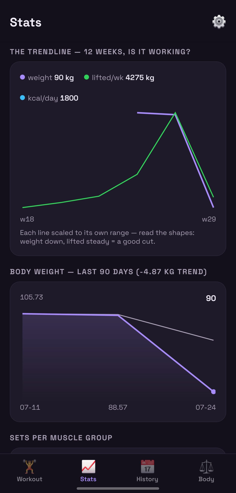
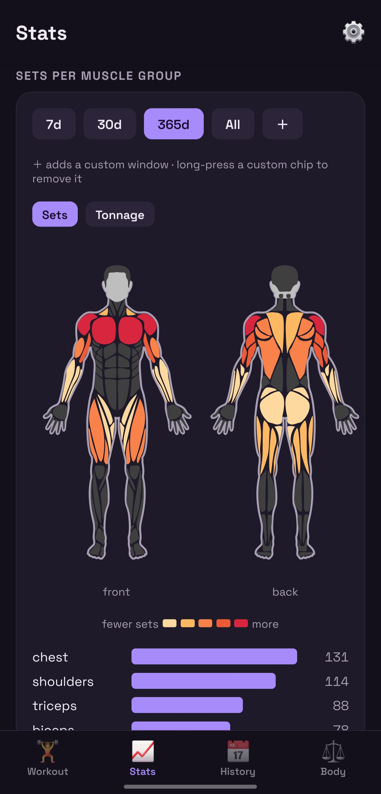
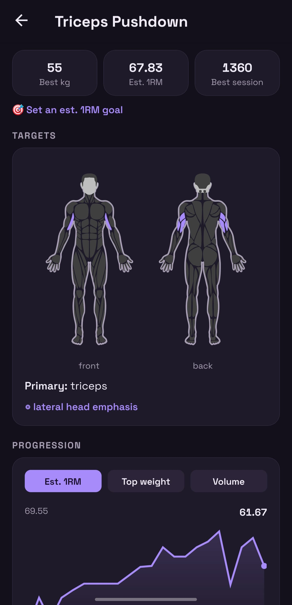
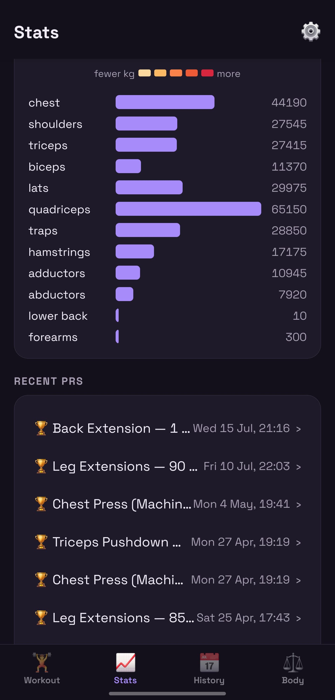
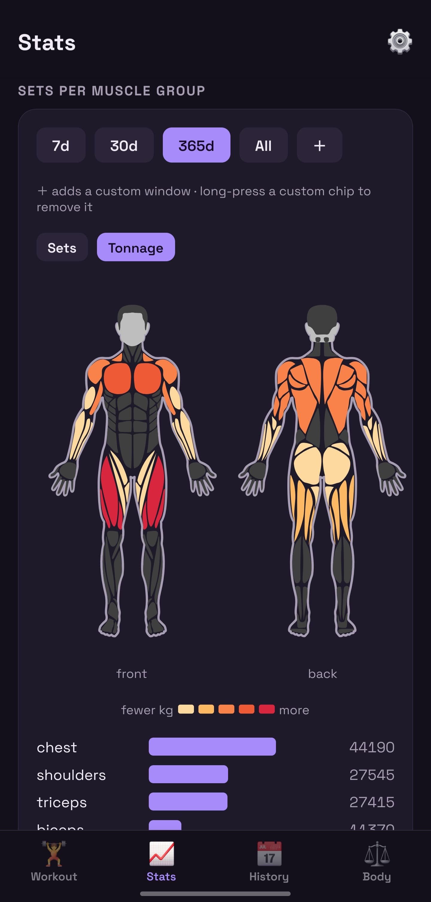
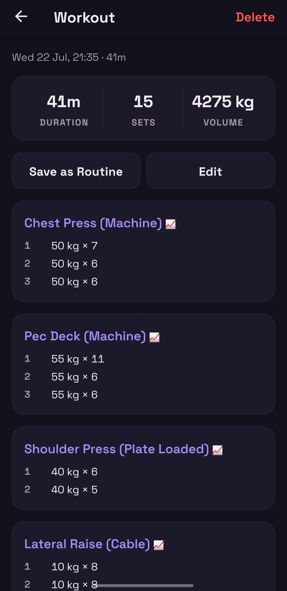

# Kilo 🏋️

Free, local-first workout + body-weight + calorie tracker. Android-first via Expo, cross-platform by design.

Built by a lifter who lost 40+ kg tracking all of this manually across paywalled apps. Kilo puts training, weight, and calories on one timeline — free forever.

## 📲 Get the app

**[Download the latest Android APK](https://github.com/ShayanAbbas1/kilo/releases/latest)** — grab the `.apk` from the latest release, install it once, and it keeps itself current: the app pulls updates over the air on restart. Play Store release is planned; until then this is the official way to get Kilo.

> Installing over an existing Kilo keeps your data. Don't uninstall first — all data lives on-device.

### Auto-updating install (recommended)

Rather than re-downloading the APK by hand, use [Obtainium](https://github.com/ImranR98/Obtainium) — an open-source installer that tracks this repo's releases and updates Kilo automatically:

1. Install Obtainium (from its [releases](https://github.com/ImranR98/Obtainium/releases), or via F-Droid / IzzyOnDroid).
2. **Add app** → paste `https://github.com/ShayanAbbas1/kilo`. On your phone you can instead tap **[Add Kilo to Obtainium](obtainium://add/https://github.com/ShayanAbbas1/kilo)** to prefill it.
3. Install. Obtainium notifies you whenever a new release ships and updates in place — your on-device data is untouched.

Day-to-day improvements still arrive over the air on app restart; Obtainium only steps in for the occasional new APK (native changes).

## Why it exists

- **Free forever, no paywall.** No backend, no accounts, no sync servers. All data lives on-device in SQLite; export/import as JSON means your data is always yours.
- **Logging that matches Strong.** Start workout → add exercises → log sets with last session's values as ghost text → rest timer. Routines, supersets, RPE, plate calculator. Switching? Import your Strong or Hevy history from their CSV exports — your analytics light up on day one.
- **Analytics no free app has.** Per-exercise progression (est. 1RM / top weight / volume), sets and tonnage per muscle group with an anatomical body heatmap down to muscle-head granularity, PR feed, and **the Trendline** — body weight, weekly tonnage, and calories on one chart.
- **Science-based exercise data.** The ~800 seeded exercises have their muscle mappings audited for anatomical accuracy — real muscles (lats, traps, erectors), not the vague region labels ("middle back", "lower back") the source dataset shipped with. So "sets per muscle group" actually reflects what you trained.
- **No barcode scanning or auto calorie logging.** Portion size, prep, brand variance, and database inaccuracy make "scan and forget" quietly wrong — it wrecks the numbers you're trying to trust. Kilo keeps calories manual: a few taps, honest about what you actually ate.

[FEATURES.md](FEATURES.md) is the spec of record — what's shipped, what's next, and explicit non-goals.

## 📸 Screenshots

<table>
  <tr>
    <td align="center" width="33%"><br><sub><b>The Trendline</b><br>weight · tonnage · calories, one chart</sub></td>
    <td align="center" width="33%"><br><sub><b>Sets per muscle</b><br>anatomical heatmap</sub></td>
    <td align="center" width="33%"><br><sub><b>Per-exercise</b><br>progression & muscle targets</sub></td>
  </tr>
  <tr>
    <td align="center" width="33%"><br><sub><b>Tonnage per muscle</b><br>+ recent PRs</sub></td>
    <td align="center" width="33%"><br><sub><b>Same heatmap</b><br>toggled to tonnage</sub></td>
    <td align="center" width="33%"><br><sub><b>Workout report</b><br>every set, logged</sub></td>
  </tr>
</table>

## Stack

- [Expo](https://expo.dev) / React Native, TypeScript, expo-router
- expo-sqlite — on-device DB is the single source of truth (kg canonical, converted at display time)
- Exercise library seeded from [free-exercise-db](https://github.com/yuhonas/free-exercise-db) (~870 exercises, public domain) + custom exercises

## Development

```bash
npm install
npm start          # scan the QR with Expo Go on Android
npm run android    # or launch the emulator
```

Note: the rest-timer background notification needs a dev build — expo-notifications silently no-ops in Expo Go on Android.

## Builds

All builds: https://expo.dev/accounts/shayanabbas/projects/kilo/builds

JS-only changes ship over the air on merge to `main` (no new APK). A new APK is only cut for native changes — when that happens, publish a new GitHub Release with the APK attached; the download link above (`/releases/latest`) always resolves to it, no README edit needed.
