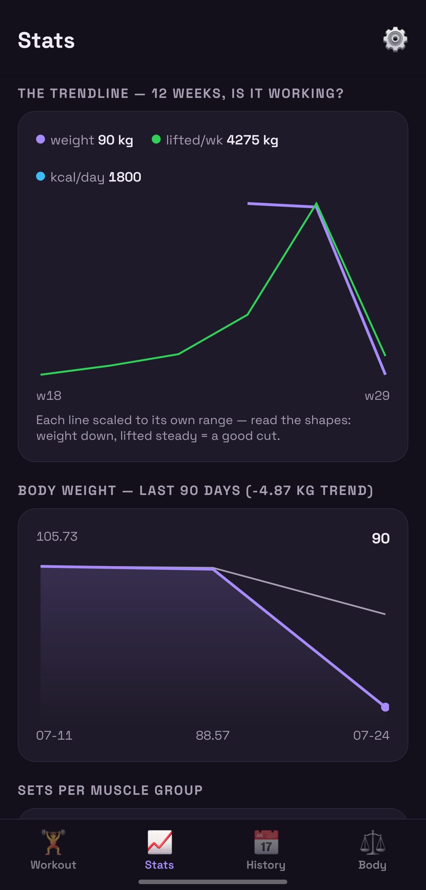
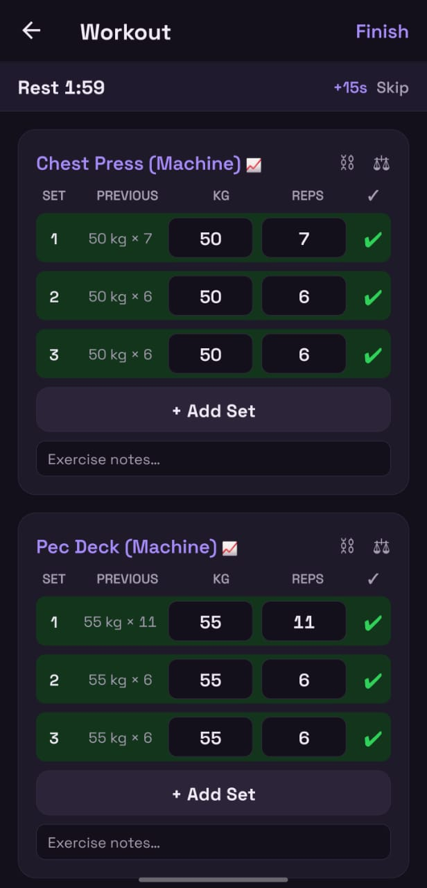
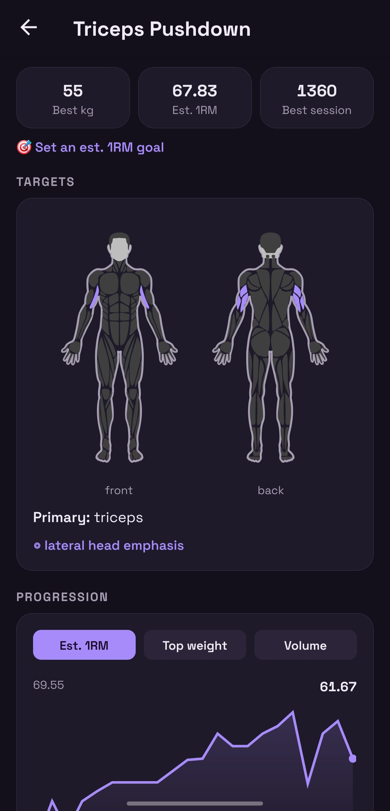
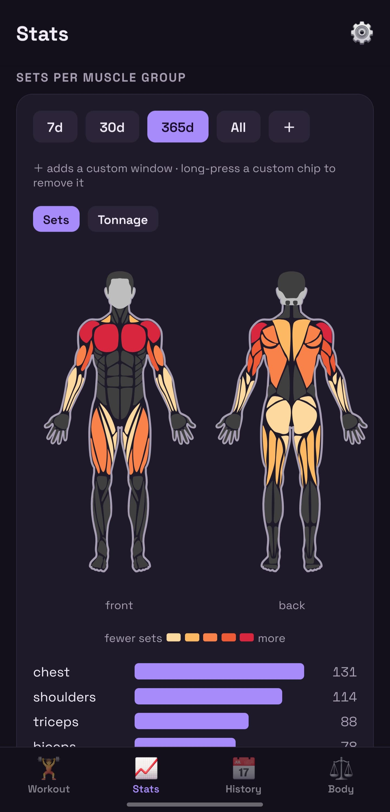
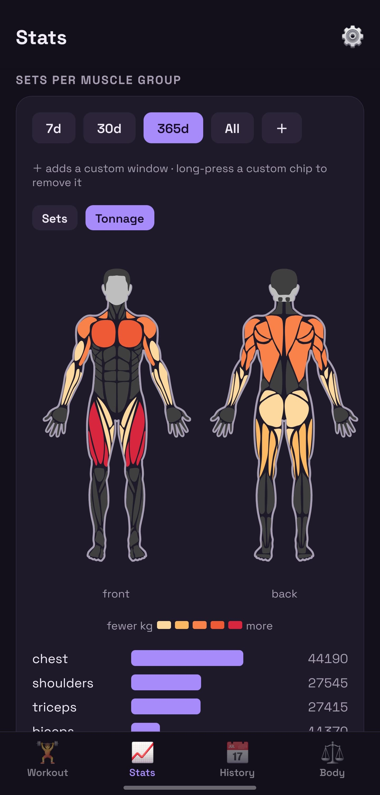
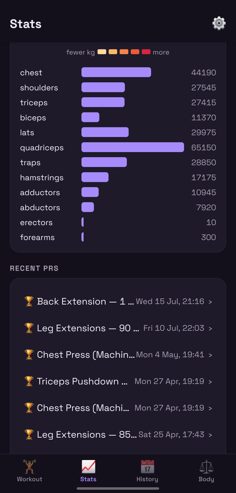
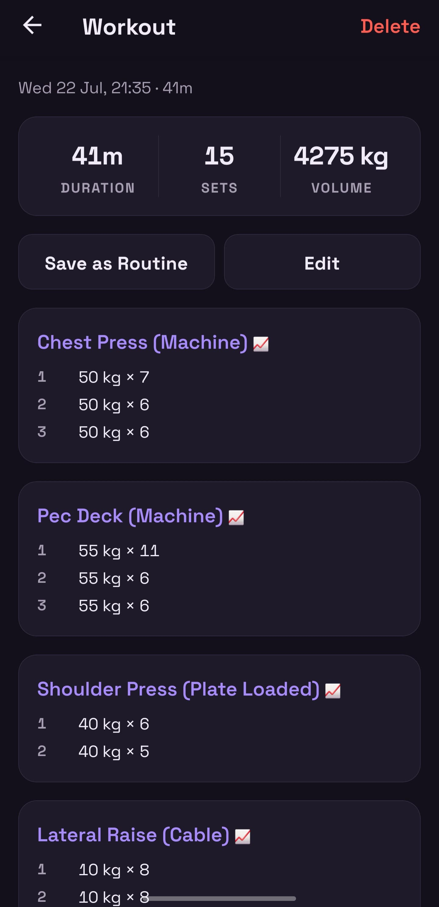

# Kilo 🏋️

Free, local-first workout, body-weight and calorie tracker for Android.

Built by a lifter who lost 40+ kg tracking all of it by hand across paywalled apps. Kilo puts training, weight and calories on one timeline — free, forever.

## 📲 Get the app

**Recommended: [Obtainium](https://github.com/ImranR98/Obtainium).** Add the repo — paste `https://github.com/ShayanAbbas1/kilo`, or tap the [one-tap link](obtainium://add/https://github.com/ShayanAbbas1/kilo) on your phone. It installs the latest release and checks GitHub for new ones, so updates come to you.

**Or: [download the APK directly](https://github.com/ShayanAbbas1/kilo/releases/latest).** No automatic updates — come back to this link for new releases.


> Installing over an existing Kilo keeps your data — don't uninstall first. All data lives on-device.

## Why it exists

- **Free forever, no paywall.** No backend, no accounts, no sync servers. Data lives on-device in SQLite and exports to JSON — it's always yours. Nothing to host means nothing to charge for.
- **Logging that matches Strong.** Sets with last-session ghost values, rest timer, routines, supersets, RPE, plate calculator. Import your Strong or Hevy history from CSV so your analytics aren't empty on day one.
- **Analytics no free app has.** Per-exercise progression (est. 1RM / top weight / volume), sets and tonnage per muscle with an anatomical heatmap (muscle mappings audited for accuracy), a PR feed, and **the Trendline** — body weight, weekly tonnage and calories on one chart.
- **Manual calories, on purpose.** No barcode or auto-logging — portion, prep and brand variance make "scan and forget" quietly wrong. A few honest taps instead.

[FEATURES.md](FEATURES.md) is the spec of record — shipped, planned, and explicit non-goals.

## 📸 Screenshots

<p align="center">
  <br>
  <sub><b>The Trendline</b> — body weight, weekly tonnage & calories on one chart, each scaled to its own range</sub>
</p>

<table>
  <tr>
    <td align="center" width="33%"><br><sub><b>Live logging</b><br>sets, rest timer, ghost values</sub></td>
    <td align="center" width="33%"><br><sub><b>Per-exercise</b><br>progression & muscle targets</sub></td>
    <td align="center" width="33%"><br><sub><b>Sets per muscle</b><br>anatomical heatmap</sub></td>
  </tr>
  <tr>
    <td align="center" width="33%"><br><sub><b>Same heatmap</b><br>toggled to tonnage</sub></td>
    <td align="center" width="33%"><br><sub><b>Tonnage per muscle</b><br>+ recent PRs</sub></td>
    <td align="center" width="33%"><br><sub><b>Workout report</b><br>every set, logged</sub></td>
  </tr>
</table>

## Stack

- [Expo](https://expo.dev) / React Native, TypeScript, expo-router
- expo-sqlite — on-device DB is the single source of truth (kg canonical, converted at display time)
- Exercise library seeded from [free-exercise-db](https://github.com/yuhonas/free-exercise-db) (~870 exercises, public domain) + custom exercises

## Development

```bash
npm install
npm start          # scan the QR with Expo Go on Android
npm run android    # or launch the emulator
```
